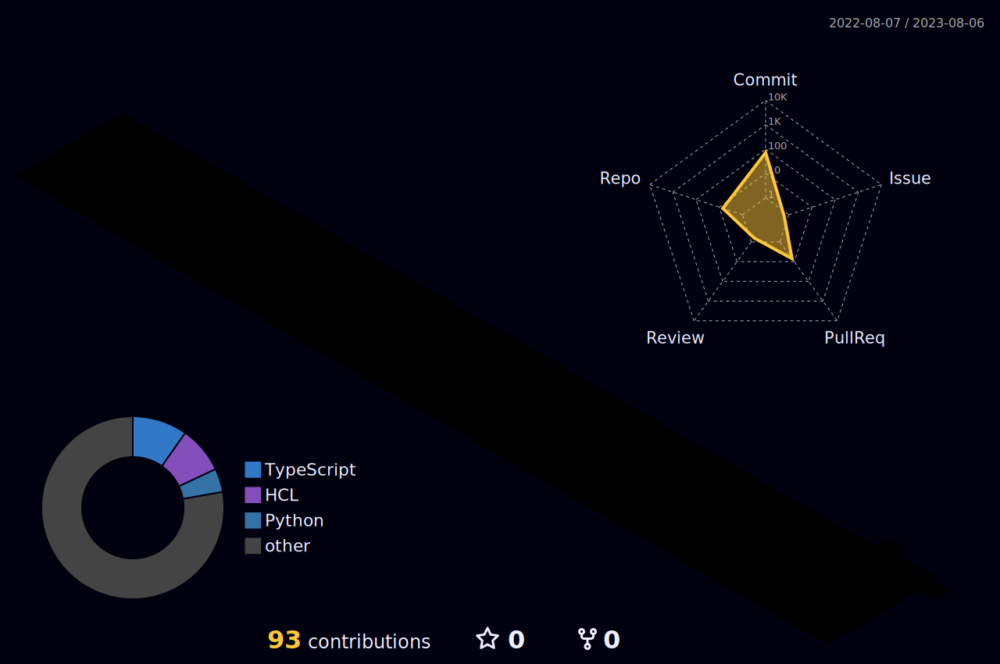

    

<!------------------------------------------------------------------------------------------------------>

<h2>Experiences</h2>

  <ul style="list-style-position: inside; text-align: center; display: inline-block;">
    <li>전) Backend Developer, Gracefulrain</li>
    <li>전) Backend Developer Intern, 오니온파이브</li>
  </ul>

 
 

<!------------------------------------------------------------------------------------------------------>

<h2>Skills & Tools</h2>

  

    
    
    
    
    
    
    
    
     
     
    
     
     
    
    
    
    
    <!--  -->
     
     
    
    
    
    
    
    <!--  -->
  

 
 

<!------------------------------------------------------------------------------------------------------>

  
  
  

 
 

<!------------------------------------------------------------------------------------------------------>

  

<!------------------------------------------------------------------------------------------------------>

